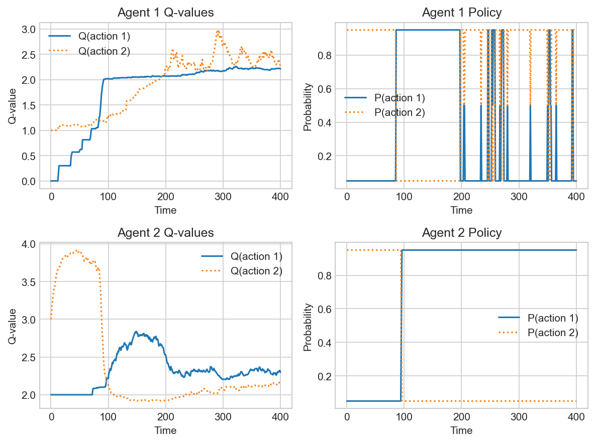
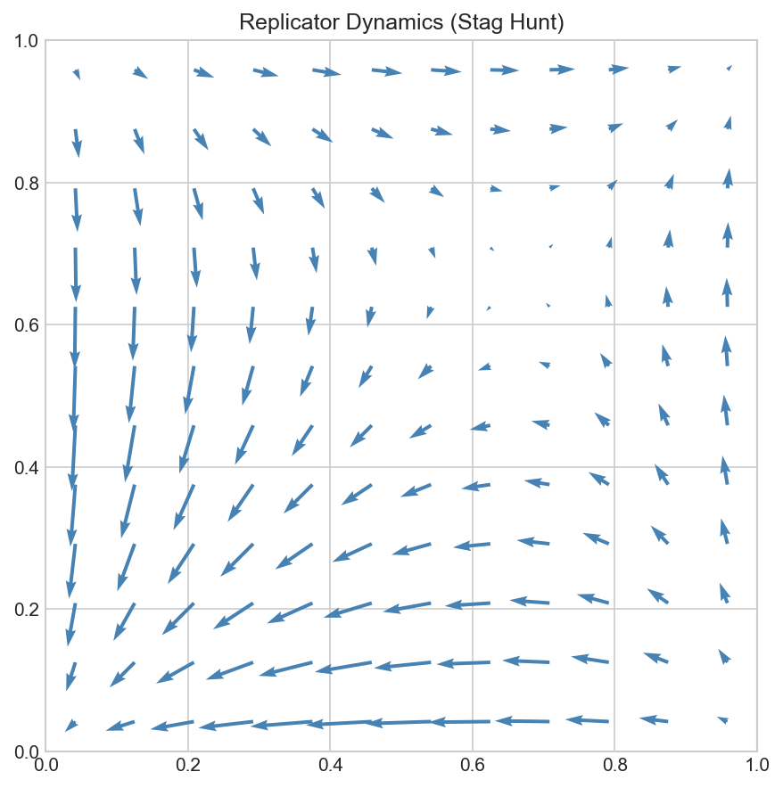
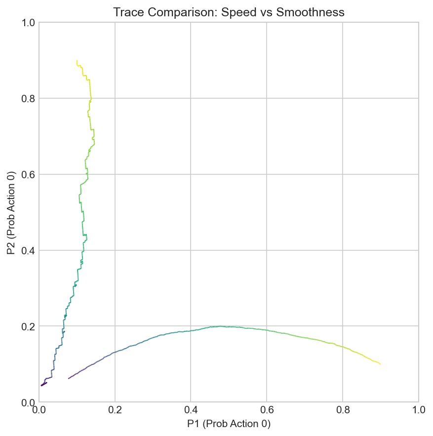
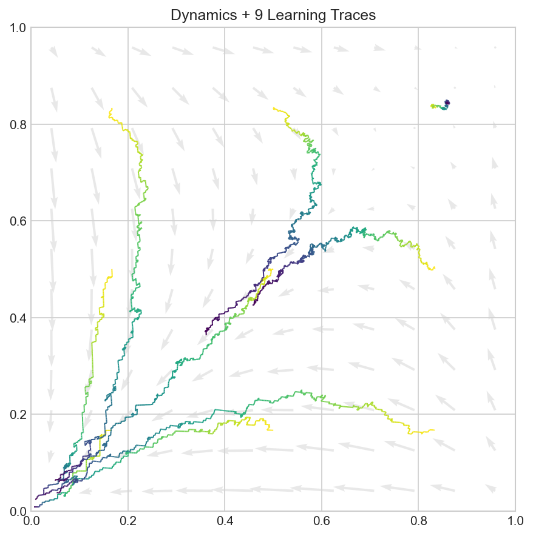

# MARL Games Toolkit

A Python library for Game Theory and Multi-Agent Reinforcement Learning (MARL).

## Installation

```bash
conda create -n gametheory python=3.10 numpy matplotlib -y
conda activate gametheory
```

## 1. Data Types & Structures

### Payoff Matrix
The core game structure. Shape `(2, 2, 2)`: `[Player, Action_P1, Action_P2]`.

```python
from marl_games import MatrixGame
# Load a predefined game (e.g., Stag Hunt)
payoff = MatrixGame.STAG_HUNT
print(payoff.shape)  # Output: (2, 2, 2)

# Access rewards: Player 0's reward when P1 chooses 0 and P2 chooses 1
reward_p0 = payoff[0, 0, 1] 
```

### Policy
Agent strategies. Shape `(2, 2)`: `[Player, Action_Probabilities]`.

```python
# Generate a policy where Player 1 chooses Action 0 with prob 0.8
# and Player 2 chooses Action 0 with prob 0.2
policy = MatrixGame.generate_policy(x=0.8, y=0.2)
print(policy)
# [[0.8 0.2]   <- Player 1 probabilities
#  [0.2 0.8]]  <- Player 2 probabilities
```

### Q-Values
Expected utility estimates. Shape `(2, 2)`: `[Player, Action_Values]`.

```python
import numpy as np
q_values = np.array([
    [1.5, 0.5],  # Player 1: Q(a0)=1.5, Q(a1)=0.5
    [0.2, 0.8]   # Player 2: Q(a0)=0.2, Q(a1)=0.8
])
```

---

## 2. Visualizations & Usage Examples

### A. Learning Summary
Track Q-values and policy probabilities over time.
*(Example: Epsilon-Greedy on Stag Hunt)*

```python
payoff = MatrixGame.STAG_HUNT
qLog = QL.epsilon_greedy_q_learning(
    payoff=payoff, 
    num_iterations=200, 
    alpha=0.1, 
    epsilon=0.1
)
QL.QPlot.summary(qLog)
```
<p align="center">
  
</p>

### B. Vector Field (Dynamics)
Visualize evolutionary dynamics (Replicator Dynamics) as a flow field.

```python
payoff = MatrixGame.STAG_HUNT
X, Y, DX, DY = DiGrid.replicator_dynamics(payoff, grid_shape=(12, 12))

# Optional: Normalize vectors for uniform arrow length
# DX, DY = DiGrid.unify_vector(DX, DY)

fig, ax = plt.subplots(figsize=(6, 6))
ax.quiver(X, Y, DX, DY, color='steelblue')
ax.set_xlim(0, 1); ax.set_ylim(0, 1)
```
<p align="center">
  
</p>

### C. Learning Trace
Compare learning trajectories with different parameters.

```python
payoff = MatrixGame.STAG_HUNT
fig, ax = plt.subplots(figsize=(6, 6))

# 1. Single Trace (Alpha=0.001)
start1 = MatrixGame.generate_policy(0.1, 0.9)
init_q1 = QL.generate_mean_q_values(payoff, 0.1, start1)
qLog1 = QL.boltzmann_q_learning(
    payoff, num_iterations=1000, alpha=0.001, temperature=0.1, init_q_values=init_q1
)
QL.QPlot.trace(ax, qLog1)

# 2. Aggregated Trace using QLogList (Mean of 32 experiments)
logList = QL.QLogList()
start2 = MatrixGame.generate_policy(0.9, 0.1)
init_q2 = QL.generate_mean_q_values(payoff, 0.1, start2)

for _ in range(32):
    log = QL.boltzmann_q_learning(
        payoff, num_iterations=1000, alpha=0.001, temperature=0.1, init_q_values=init_q2.copy()
    )
    logList.append(log)

QL.QPlot.trace(ax, logList.mean()) # Plot the average trace
```
<p align="center">
  
</p>

### D. Dynamics + Trajectories
Batch generation of traces over a grid.

```python
payoff = MatrixGame.STAG_HUNT

# 1. Background: Dynamics
X, Y, DX, DY = DiGrid.boltzmann_replicator_dynamics(
    payoff, grid_shape=(12, 12), temperature=0.1
)
fig, ax = plt.subplots(figsize=(6, 6))
ax.quiver(X, Y, DX, DY, color='lightgray', alpha=0.5)

# 2. Foreground: 9 Traces using generate_policy_grid
# Generates a 3x3 grid of starting policies
policy_grid = MatrixGame.generate_policy_grid((3, 3))

for init_policy in policy_grid:
    init_q = QL.generate_mean_q_values(payoff, 0.1, init_policy)
    qLog = QL.boltzmann_q_learning(
        payoff, num_iterations=1000, alpha=0.001, temperature=0.1, init_q_values=init_q
    )
    QL.QPlot.trace(ax, qLog)

ax.set_xlim(0, 1); ax.set_ylim(0, 1)
```
<p align="center">
  
</p>

---

## 3. Algorithms Reference

### Epsilon-Greedy Q-Learning
Classic exploration-exploitation trade-off. Chooses best action $(1-\epsilon)$ of the time, random $\epsilon$.

```python
from marl_games import QL
import numpy as np

# User-specified payoff matrix
payoff_matrix = np.array([
    [[2, 3], [4, 1]],
    [[3, 1], [2, 4]]
], dtype=np.float64)

# Configuration
num_iterations = 400
num_experiments = 1000
init_q_values = np.array([[0, 1], [2, 3]], np.float64)

# Run multiple experiments
qLogList = QL.QLogList()
for i in range(num_experiments):
    qLog = QL.epsilon_greedy_q_learning(
        payoff=payoff_matrix, 
        num_iterations=num_iterations,
        init_q_values=init_q_values.copy(),
        alpha=0.1,
        epsilon=0.1
    )
    qLogList.append(qLog)

# Aggregate results (median)
qLog = qLogList.median()
```

### Boltzmann Q-Learning
Softmax action selection. Probability proportional to $e^{Q/T}$.

```python
# Standard Parameters
log = QL.boltzmann_q_learning(
    payoff=payoff,
    num_iterations=1000,
    alpha=0.001,    # Smoother learning rate
    temperature=0.1, 
    adjust_frequencey=True
)

# Associated Dynamics
X, Y, DX, DY = DiGrid.boltzmann_replicator_dynamics(
    payoff, grid_shape=(12, 12), temperature=0.1
)
```

### Lenient Boltzmann Q-Learning
"Lenient" learners ignore low rewards initially to overcome coordination failure.

```python
log = QL.lenient_boltzmann_q_learning(
    payoff=payoff,
    num_iterations=1000,
    alpha=0.001,
    temperature=0.1,
    kappa=3,         # Leniency: How many max rewards to keep in buffer
    adjust_frequencey=True
)

# Associated Dynamics
X, Y, DX, DY = DiGrid.lenient_boltzmann_replicator_dynamics(
    payoff, grid_shape=(12, 12), temperature=0.1, kappa=3
)
```

## References
1. **Q-Learning**: Watkins, C.J.C.H. (1989). *Learning from Delayed Rewards*.
2. **Epsilon-Greedy Dynamics**: Wunder et al. (2010). *Dynamic Analysis of Multiagent Q-learning with Epsilon-Greedy Exploration*.
3. **Boltzmann Exploration**: Sutton & Barto (2018). *Reinforcement Learning: An Introduction*.
4. **Lenient Learning**: Panait et al. (2008). *Theoretical Advantages of Lenient Learners*.
